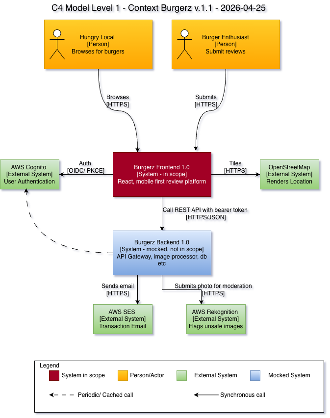
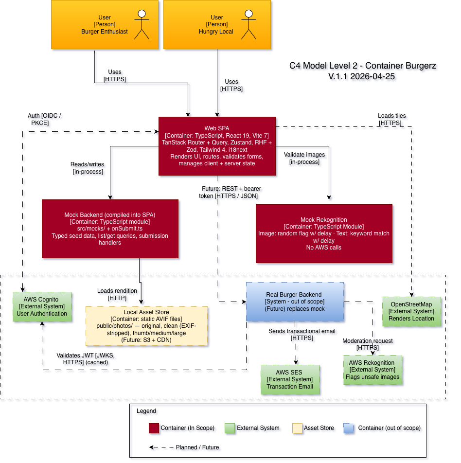

# Burgerz Architecture

## Level 1 - Context

### What it shows

Describing who uses burgerz, and which other systems it talks to (or will talk to once the backend exists).

### Who uses it

| User | What they want |
| ---- | -------------- |
| Hungry Local | Find a restaurant to eat at right now |
| Burger Enthusiast | Write a review with scores and a photo |

### What we build

**Burgerz Frontend 1.0** — a React 19 + Vite 7 web app, mobile-first, served as static files. This is the only thing this repo builds.

### What we connect to

| System | Status | What it does |
| ------ | ------ | ------------ |
| Burgerz Backend 1.0 | Mocked inside the app | The real API, image processing, and database |
| AWS Cognito | (Future) | Logs users in |
| OpenStreetMap | (Future) | Map tiles for the restaurant page |
| AWS SES | (Future) | Sends email |
| AWS Rekognition | Mocked | Checks if photos and text are safe |

* Mock backend [src/mocks/](../src/mocks/) 
* The fake Rekognition [src/helperFunctions/rekognitionService.ts](../src/helperFunctions/rekognitionService.ts).

## Level 2 — Containers

### What we build

| Piece | Built with | What it does |
| ----- | ---------- | ------------ |
| **Web app** | React 19, Vite 7, TypeScript | Shows all the UI |
| **Router** | TanStack Router ([src/routes/](../src/routes/)) | Decides which page to show for each URL |
| **Server data** | TanStack Query | Fetches and caches data from the (fake) API |
| **Local state** | Zustand ([src/store/](../src/store/)) | Holds short-lived UI state |
| **Forms** | React Hook Form + Zod | Builds the review form and checks the input |
| **Translations** | i18next ([src/common/i18n.ts](../src/common/i18n.ts)) | Handles different languages |
| **Styles** | Tailwind CSS 4 | Styles everything |
| **Fake backend** | TypeScript files in [src/mocks/](../src/mocks/) | Stands in for the real backend until 2.0 |

### What we'll connect to later

| Piece | Status |
| ----- | ------ |
| Real backend (API, image processor, database) | (Future) — faked for now |
| S3 (photo storage) | (Future) — local files in [public/photos/](../public/photos/) for now |
| CDN (CloudFront / Cloudflare / Imgix — to be decided) | (Future) |

### How the main flows work

**Looking at a restaurant (US-1):** the router opens `/restaurants/$id` → the page asks TanStack Query for the data → Query reads it from the fake backend → a helper ([src/helperFunctions/openingHours.ts](../src/helperFunctions/openingHours.ts)) works out if the place is open now → the page renders.

**Writing a review (US-2):** the form ([src/pages/Create.tsx](../src/pages/Create.tsx)) collects the scores, text, and photo → Zod checks the input → `onSubmit` ([src/helperFunctions/onSubmit.ts](../src/helperFunctions/onSubmit.ts)) sends it to the fake backend → the fake backend pretends to run Rekognition and may flag the photo → the UI shows a confirmation.
